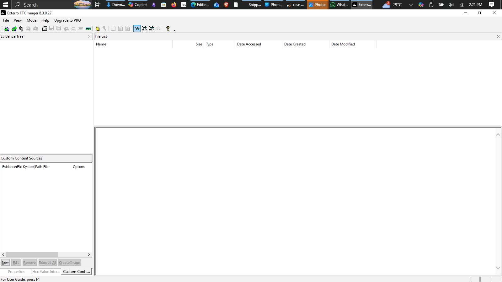
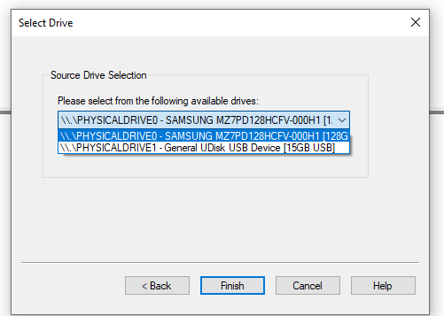
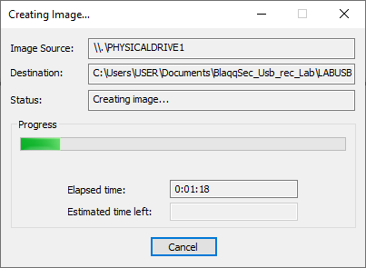
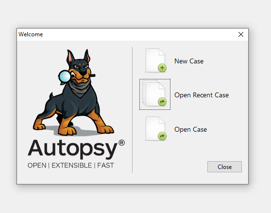
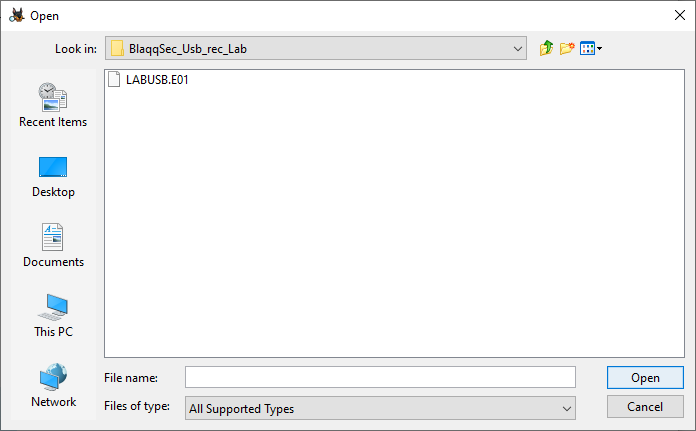
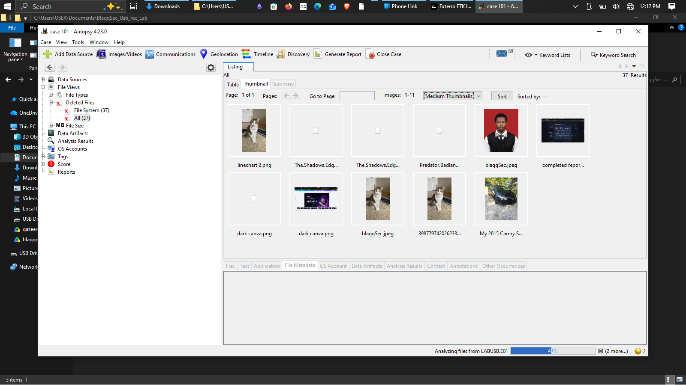
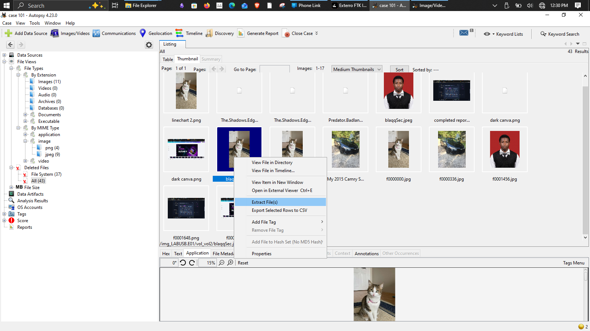
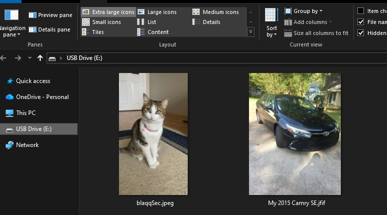
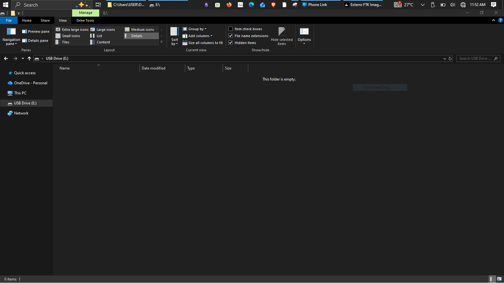

# digital-forensics-lab
Step-by-step forensic lab: deleted file recovery using FTK Imager &amp; Autopsy.
# Digital Forensics Lab

This project documents the forensic process of imaging a USB drive using FTK Imager and recovering deleted files with Autopsy.  
Screenshots are included only at key points to provide clear evidence without clutter.

## Step 1: Evidence Preparation

To simulate a real forensic scenario, I prepared the USB flash drive by:

- Downloading two sample images:
  - **Cat** 🐱  
    
  - **Black Car** 🚗  
    

- Saving them onto the USB flash drive.
- Deleting both files to create a case of potential evidence loss.

This setup ensures that when the forensic recovery is performed, the **Cat image** reappears in the recovered files — making it clear that deleted data can still be retrieved.

---

## FTK Imager Workflow

1. **Open FTK Imager**  
   

2. **Click the File tab (top right) → Select "Create Disk Image"**  

3. **Choose Physical Drive → Select your drive**  
   

4. **Select Image type (E01) → Enter case name, number, and destination**  

5. **Click Start → cloning begins**  
   

---

## Autopsy Recovery Workflow

1. **Open Autopsy → Create a New Case**
   - Select **Case Source**.
   - Enter a **Case Name**.
   - Skip optional information (or fill if needed).
   - Click **Finish** → Autopsy creates a database for the case.  
   

2. **Select Host → Click Next**
   - Choose **Disk Image or VM File**.
   - Select the cloned file created earlier with FTK.
   - Click **Finish** → Autopsy loads the evidence.  
   

3. **Navigate to Deleted Files**
   - Autopsy automatically recovers deleted files.
   - Go to the **Deleted Files** section.
   - Select all recovered files.  
   

4. **Export Evidence**
   - Right‑click the recovered file(s).
   - Choose **Export**.
   - Save them into your recovery folder.  
   

---

## USB Evidence

- **Before deletion**  
  

- **After deletion**  
  

---

## Notes

- FTK Imager was used to create a forensic image of the USB drive in E01 format.  
- Autopsy was used to analyze the image, recover deleted files, and export them for evidence.  
- Screenshots provide proof of each critical step in the forensic workflow.
